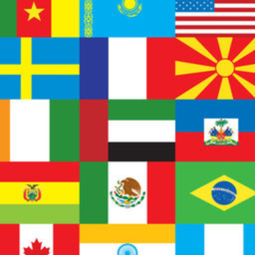

<!--
*** Thanks for checking out the Best-README-Template. If you have a suggestion
*** that would make this better, please fork the repo and create a pull request
*** or simply open an issue with the tag "enhancement".
*** Don't forget to give the project a star!
*** Thanks again! Now go create something AMAZING! :D
-->

<!-- PROJECT SHIELDS -->
<!--
*** I'm using markdown "reference style" links for readability.
*** Reference links are enclosed in brackets [ ] instead of parentheses ( ).
*** See the bottom of this document for the declaration of the reference variables
*** for contributors-url, forks-url, etc. This is an optional, concise syntax you may use.
*** https://www.markdownguide.org/basic-syntax/#reference-style-links
-->
[![Contributors][contributors-shield]][contributors-url]
[![Forks][forks-shield]][forks-url]
[![Stargazers][stars-shield]][stars-url]
[![Issues][issues-shield]][issues-url]
[![GPL v3.0 License][license-shield]][license-url]
[![LinkedIn][linkedin-shield]][linkedin-url]

<!-- PROJECT LOGO -->
 

  

<h3 align="center">Flags</h3>
  

    Flags is an Android game that makes it super straight forward and fun to learn the flags of the World!
     
     
    <a href="https://github.com/fatonhoti/Flags/issues">Report Bug</a>
    ·
    <a href="https://github.com/fatonhoti/Flags/issues">Request Feature</a>
  

<!-- ROADMAP -->
## Roadmap

- [ ] Add new regions
- [ ] Support for dark mode
- [ ] Track fun statistics such as games played and average score per game.
- [ ] Support for other languages (only English available right now)

See the [open issues](https://github.com/fatonhoti/Flags/issues) for a full list of proposed features (and known issues).

<!-- CONTRIBUTING -->
## Contributing

Contributions are what make the open source community such an amazing place to learn, inspire, and create. Any contributions you make are **greatly appreciated**.

If you have a suggestion that would make this better, please fork the repo and create a pull request. You can also simply open an issue with the tag "enhancement".
Don't forget to give the project a star! Thanks again!

1. Fork the Project
2. Make your changes
3. Make a commit
5. Open a Pull Request

<!-- LICENSE -->
## License

Distributed under the MIT License. See `LICENSE` for more information.

<!-- CONTACT -->
## Contact

Faton Hoti - hotifaton@outlook.com

Project Link: [https://github.com/fatonhoti/FlagsGame](https://github.com/fatonhoti/FlagsGame)

<!-- ACKNOWLEDGMENTS -->
## Acknowledgments

* [worldCountryData](https://github.com/blongho/worldCountryData)
* [Best README template](https://github.com/othneildrew/Best-README-Template)

<!-- MARKDOWN LINKS & IMAGES -->
<!-- https://www.markdownguide.org/basic-syntax/#reference-style-links -->
[contributors-shield]: https://img.shields.io/github/contributors/fatonhoti/FlagsGame.svg?style=for-the-badge
[contributors-url]: https://github.com/fatonhoti/FlagsGame/graphs/contributors
[forks-shield]: https://img.shields.io/github/forks/fatonhoti/FlagsGame.svg?style=for-the-badge
[forks-url]: https://github.com/fatonhoti/FlagsGame/network/members
[stars-shield]: https://img.shields.io/github/stars/fatonhoti/FlagsGame.svg?style=for-the-badge
[stars-url]: https://github.com/fatonhoti/FlagsGame/stargazers
[issues-shield]: https://img.shields.io/github/issues/fatonhoti/FlagsGame.svg?style=for-the-badge
[issues-url]: https://github.com/fatonhoti/FlagsGame/issues
[license-shield]: https://img.shields.io/github/license/fatonhoti/FlagsGame.svg?style=for-the-badge
[license-url]: https://github.com/fatonhoti/FlagsGame/blob/main/LICENSE
[linkedin-shield]: https://img.shields.io/badge/-LinkedIn-black.svg?style=for-the-badge&logo=linkedin&colorB=555
[linkedin-url]: https://www.linkedin.com/in/faton-hoti-8318b0224/
